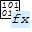

#### 

[Project](../../../../../../index.md) > [SQLserver](../../../../../index.md) > [User databases](../../../../index.md) > [RTIPDataSQL](../../../index.md) > Programmability > Functions > [Scalar-valued Functions](Scalar-valued_Functions.md) > dbo.tipfn_strip

#  [dbo].[tipfn_strip]

---

## Properties

| Property | Value |
|---|---|
| ANSI Nulls On | YES |
| Quoted Identifier On | YES |

---

## Parameters

| Name | Data Type | Max Length (Bytes) |
|---|---|---|
| @in_string | nvarchar(max) | max |

---

## Permissions

| Type | Action | Owning Principal |
|---|---|---|
| Grant | EXECUTE | db_spexecute |

---

## Used By

* [[dbo].[tipfn_STIP_export_prep]](../Table-valued_Functions/dbo_tipfn_STIP_export_prep.md)
* [[dbo].[tipfn_STIP_export_prep_amendment]](../Table-valued_Functions/dbo_tipfn_STIP_export_prep_amendment.md)

---

###### Author:  Chris Peak

###### Copyright 2025 - All Rights Reserved

###### Created: Monday, October 20, 2025 11:01:15 AM

